# Clusters and Hadoop Ecosystem

## File Systems

### Block Devices

Block devices (HDD, SSD) are block-addressable. A block is, for example, 4 KB. File systems manage the blocks.

Optimizing Disk I/O with Memory: Caching and Buffering

- Linux page cache: A cache of disk blocks in RAM. It's used to speed up access to files on disk by keeping a copy of the disk blocks in RAM. It's also used to buffer writes to disk, so that the writes can be done in larger chunks, which is more efficient.
- Python buffer: A buffer for reading and writing data to a file. It's used to speed up I/O by reducing the number of system calls needed to read or write data. System calls are needed to visit Linux page cache.

```python
stations = []
line_len = 86
start = time.time()
with open("ghcnd-stations.txt",
          "rb", buffering=0) as f:
    offset = 0
    while True:
        f.seek(offset)
        station = str(f.read(11), "utf-8") offset += line_len
        if station:
            stations.append(station)
        else: 
            break
print(time.time() - start)
```

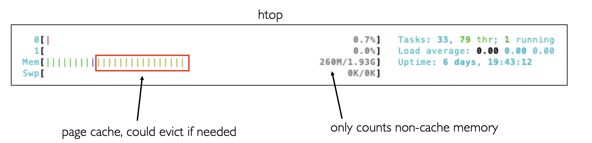

Limitation: Buffering cannot help with random access patterns. Only reading one column is similar to random access patterns.

HDD: 

- latency = seek time, rotational latency, transfer rate. Seek time and rotational latency dominates.
- One optimization: short stroking. Because head moves faster to outside tracks, some only use outside tracks.

SSD: No moving parts, inherently parallel.

- Page: Unit that we can read or write (couple KBs). In OS, a page is a unit of memory that can be swapped in and out of RAM (e.g. 4 KB).
- Block: unit that is erased together (100s of KBs). In OS, a block is a unit of storage that can be read or written to disk.

Because of difficulty to rewrite, SSDs try to sequentially write the whole block when possible (e.g. 512 bytes).

| Metric | HDD | SSD |
| --- | --- | --- |
| capacity | | worse |
| latency | | much better |
| throughput | | a little better |
| random IOPS | | even better (low latency AND in parallel) |
| random writes | | better, but block erase could be slow |
| random reads | | much better |

- Partitions: `ls /dev/sd*` in Linux
- RAID: RAID controller can make multiple devices appear as one

### File Systems

File systems abstract storage for us.

Types of file systems:

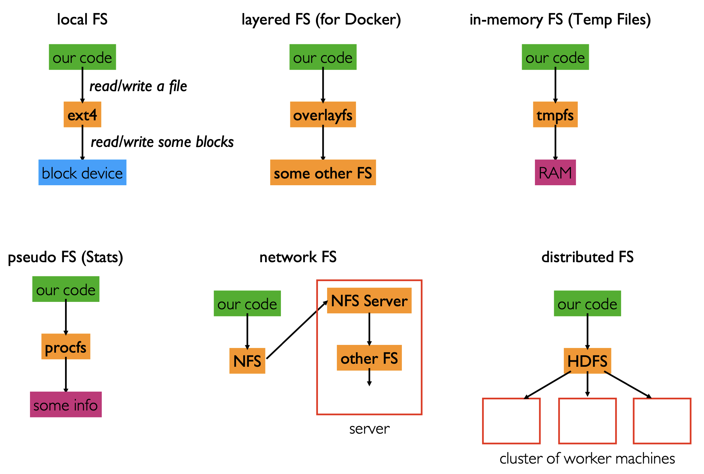

** Synthetic file system or a pseudo file system: It is a hierarchical interface to non-file objects that appear as if they were regular files in the tree of a disk-based or long-term-storage file system. These non-file objects may be accessed with the same system calls or utility programs as regular files and directories. The common term for both regular files and the non-file objects is node.

Files are represented by inodes. A directory is a file containing a list of inodes.

File systems is logically represented as a tree.

- In windows, there might be multiple trees, each with a different root, like `C:\` and `D:\`.
- In Linux, there is only one tree, with `/` as the root. Different partition or other file systems can be mounted at different points in the tree, using `mount` command.
- In docker, each container has its own root file system and mount namespace. It can also share part of the file system with the host or other containers.

### File Formats

Inside a file, there are two ways to organize the bytes:

- Using a certain file format, like Parquet, Avro, etc.
- Using a database, like SQLite, MySQL, etc.

Goals for a certain file layout:

- Efficient I/O from storage
- Minimizing parsing/deserialization computation time

Assumptions made:

- Bytes of a file are consecutively mapped to blocks on a storage device.
- Need to define the way code accesses the data. Major access patterns:
  - Transaction processing: Reading/changing a row / a few rows as needed by an application
  - Analytics processing: Computing over a large number of rows for specific columns

E.g.

| | CSV | Parquet |
| --- | --- | --- |
| orientation| row | column |
| encoding | text | binary |
| compression | none | snappy (default) |
| schemas | none/inferred | explicit |

- Encoding
  - Text encoding store all characters in a file as a sequence of bytes. Using ASCII, UTF-8, UTF-16, etc as the encoding format. Human-readable.
  - Normally text encoded file takes up more space. "12" is stored as `0x31 0x32` in ASCII, taking up 2 bytes.
  While in parquet, 12 is stored as int64, taking up 8 bytes, or int32, taking up 4 bytes.
  - More computation is needed for CSV files to be ready for computation on the CPU.
- Compression: 
  - Idea---avoid repeating yourself. Repetitive information is stored as a reference to the first copy. 
  - Snappy aims for very high speeds and reasonable compression. The current snappy compressor only matches repetitions within 32 kB blocks.
  - Compression generally works better for column-oriented data.
- Schemas
  - CSV schemas are specified as a dict in pandas. `pd.read_csv("file.csv", dtype={"col1": "int32", "col2": "float64"})` or inferred from the data (slow and error-prone, see below).
  - In parquet, the schema is stored in the file.

```python
df = (spark.read.format("csv")
  .option("header", True)
  .option("inferSchema", True)
  .load("hdfs://nn:9000/sf.csv"))
```

InferSchema for csv files takes significantly longer time than specifying the schema or using parquet files. Spark reads the whole file to infer the schema (mainly the type of each column).

## SQL Databases

Database management systems manage all the resources we covered in this class: storage, memory, network, compute.

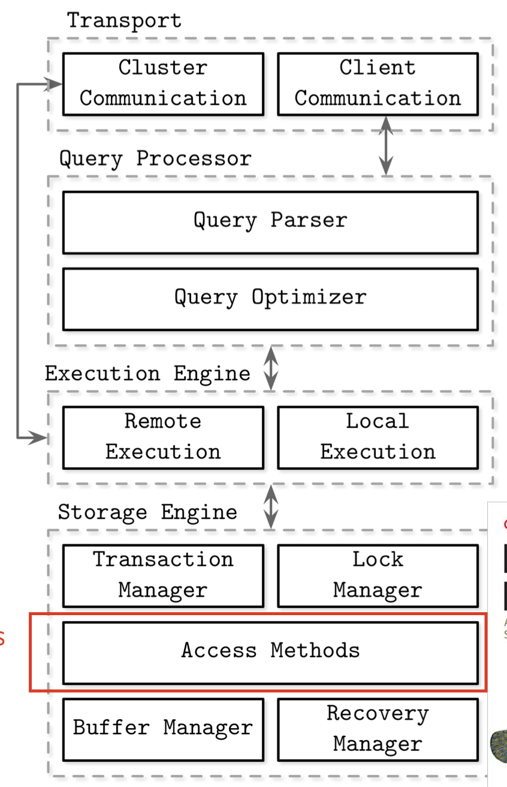

Databases pros/cons (compared to just using files):

- "[databases] tightly couple their internal layout of the data and indexes in on-disk files with their **highly optimized query processing engines**, thus providing very fast computations on the stored data..."
- "Databases store data in **complex (often proprietary) formats** that are typically highly optimized for only that database’s SQL processing engine to read. This means *other processing tools, like machine learning and deep learning systems, cannot efficiently access the data* (except by inefficiently reading all the data from the database)."

SQL as a language works greatly for both transaction processing and analytics processing. But It is hard for a single database to be optimized for both. Main database types:

- OLTP (Online Transaction Processing) databases: MySQL, PostgreSQL, etc. Typical design: row-oriented, B-tree indexes, etc.
- OLAP (Online Analytics Processing) databases: Redshift, BigQuery, etc. Typical design: column-oriented, bitmap indexes, etc.

What if we want to use a database for transaction processing and analytics processing?

Vocab:

- Data warehouse: A OLAP database where we combine data from many sources (likely OLTP databases)
- ETL: Extract, Transform, Load. The process of getting data from many sources, transforming it into a format suitable for analytics, and loading it into a data warehouse.

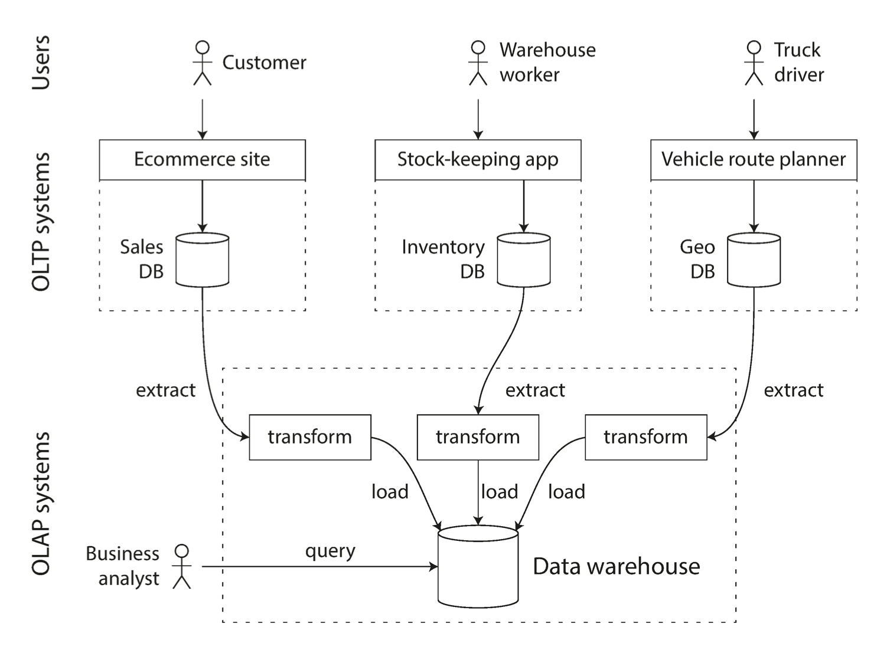

Normalization trade-offs:

- Pros: Avoiding redundancy and update anomalies (maintaining consistency), often saving space
- Cons:
  - Queries are sometimes slower, especially when joining many tables
  - How to deal with historical record keeping? (e.g. a customer's address change)

Transactions

- Definition 1: Opposed to analytics
- Definition 2: Guaranteeing ACID properties (Atomicity, Consistency, Isolation, Durability)

General query structure: 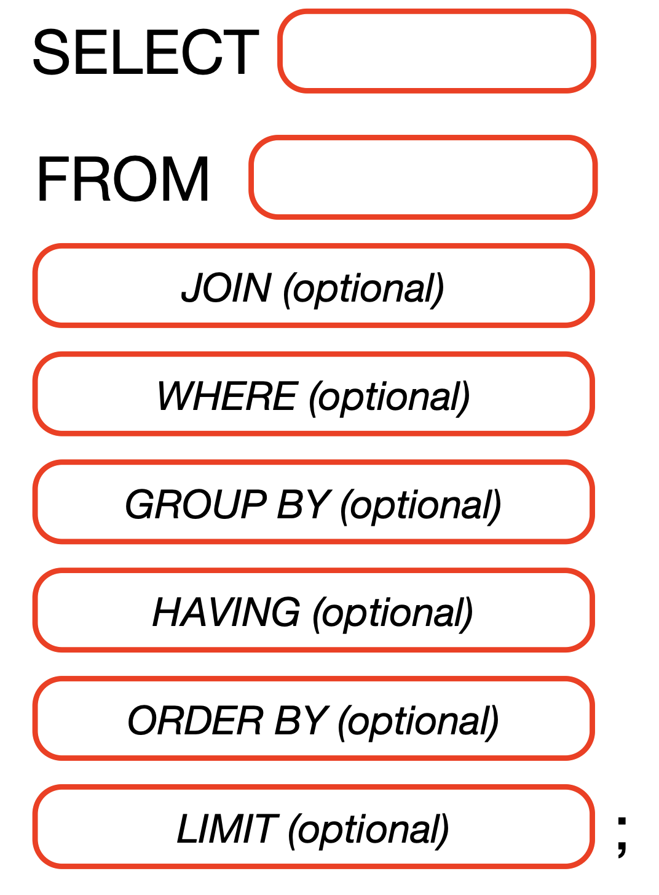

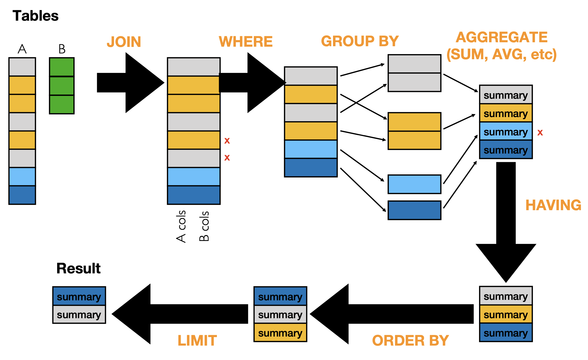

## Hadoop Ecosystem

Motivation:

- Techniques in traditional databases, e.g. Join, are not suitable in a distributed system
- New problems brought about by distributed systems, e.g. fault tolerance (especially using a lot of cheap commercial machines), data locality

Hadoop is built mirroring Google's systems

- HDFS: GFS
- Hadoop MapReduce -> Spark: MapReduce
- HBase -> Cassandra: Bigtable

## HDFS

- Big files are partitioned into blocks (128 MB by default)
- Files are replicated across multiple machines (3 by default). Recently HDFS also uses erasure encoding to handle node failure for cold data. It is more space efficient but less IO efficient (not covered in CS 544).

Reads/writes optimization:

- Concurrent reads: Network bandwidth of client computer may become a bottleneck
- Pipelined writes: Data is written to one machine first. Then that machine writes to another replica.

Replication copies trade-off:

- Pros: High fault tolerance, high read throughput
- Cons: Synchronization of replicas (need to write into multiple locations), space

Block size trade-off:

- Pros: Less metadata
- Cons: Fragmentation

NameNode + DataNode

- Heartbeat messages
  - \> M seconds: DataNode is stale
  - \> N seconds: DataNode is dead

## Data Lake: Decoupled storage/compute for analytics (Design similar to Snowflake)

## Hadoop MapReduce

Example map function:

```python
def map(key, value):
  # key: id
  # value: row content
  if value.shape == "square":
      emit(key, value.color)
```

Example reduce function:

```python
def reduce(key, values):
  count = len(values)
  emit(key, count)
```

A reducer is needed to combine the results of distributed mappers, even not doing additional computation.

Data is first grouped and sorted by key in a shuffle phase, then passed to the reducer. Reduce will be called for each unique key. All rows with the same key go to the same reducer. Each reducer produces one output file.

Comparison with SQL

- Map phase: SELECT, WHERE
- Shuffle phase: GROUP BY, ORDER BY
- Reduce phase: AGGREGATE, HAVING
- Involving multiple phases: JOIN
  - Hash join: Shuffle (hashing) + Reduce
  - Sort-merge join: Shuffle (sorting) + Reduce
  - Index join: Map (map unindexed tuples to indexed tuples)

MapReduce is more flexible but not as usable.

Pipelining MapReduce Jobs? Is storing intermediate data in HDFS a good idea?

- Replication is wasteful when we could easily recompute data
- Could we sometimes connect output from one stage more directly to the next, without writing to HDFS and relying on intermediate files to connect independent stages?
- Treating each stage independently forgoes the room for optimization of the whole pipeline.

--- Spark RDDs

## Spark

### Resilient Distributed Datasets (RDDs)

- Data lineage: record series of operations on other data necessary to obtain results
- Lazy evaluation: computation only done when results needed (to write file, make plot, etc.)
- Immutability: you can't change an RDD, but you can define a new one in terms of it

Comparing to PyTorch DAG: PyTorch computes results eagerly, but lineage is tracked for the purpose of computing gradients

- Transformations create new RDDs, e.g. `map()`, `filter()`
  - The order of transformations can be easily switched between logical equivalents, e.g. filtering early to optimize the computation. Lazy evaluation allows this.
  - In what granularity should data flow through the transformation? E.g. the whole dataset, a partition, or a row.
    - Narrow dependency allows the granularity of a row or a few rows
    - Wide dependency requires the whole dataset, but could be optimized by partitioning
- Actions return results, e.g. `collect()`, `saveAsTextFile()`, `take(n)` (take the first n elements), `mean()`, `count()`, `columns()` (only in DataFrames). `collect()` or `toPandas()` will gather all elements of the dataset to the driver. It is not recommended for large datasets. If possible, use `where(???)` to do filtering first.

Jobs -- stages -- tasks

Task: Run on a single core, load a single partition to memory, and operate on it.

Choosing partition count directly affects number of tasks necessary to do a job. Larger partitions---

- Pros: Less overhead in starting tasks
- Cons: Might not utilize all cores, harder to balance load, may not fit in memory

Partitioning

- Normal: The rows are divided roughly evenly into partitions, and there is no guarantee about what row will be in what partition.
- Hash: The rows are divided into partitions based on the hash of a column. This is useful when you want to join two datasets on a column, and you want rows with the same value of that column to be in the same partition.

Partitioning coallescing: The boss checks the sizes of fragments of partition data before those partitions are sent over the network.  It then combines some partitions together to form bigger partitions, ideally similar in size.  Executors are informed of the combining decisions.

`bucketBy()` is the action equivalent to partitioning. It will write the data to disk in the specified number of buckets. Afterwards when we read the data back in, it will be partitioned by the bucket number.

Operations with narrow dependencies output the same number of partitions they receive. if the data is growing/shrinking a lot after a transformation, you might want to change the partition count. `rdd.getNumPartitions()` to check the partition count, `rdd.repartition(n)` to change the partition count.

```python
from pyspark import StorageLevel
df2.persist(StorageLevel.MEMORY_ONLY)
```

RDDs used repeatedly can be cached in memory. Caching is a transformation, so it's lazy. Only when an action is called on the RDD is it actually cached. Therefore, it is useful only when it is accessed the second time and later. `rdd.cache()` is equivalent to `rdd.persist(StorageLevel.MEMORY_ONLY)`. `rdd.unpersist()` to remove the cache.

- MEMORY_ONLY: data is represented as JVM objects on which computation can be done directly.  Unfortunately, JVM objects are somewhat bloated (often using 2-5x more memory than the actual data, see below).
  - MEMORY_ONLY_2: data is replicated on two nodes.
- MEMORY_ONLY_SER: data is serialized to a compact byte format.  This saves space, but data partitions must be transformed to JVM objects every time computation is done on them.
- DISK_ONLY: data is serialized and stored on disk.

[Java object v.s. serialized storage](https://spark.apache.org/docs/2.2.2/tuning.html#memory-tuning):

- Each distinct Java object has an “object header”, which is about 16 bytes and contains information such as a pointer to its class. For an object with very little data in it (say one Int field), this can be bigger than the data.
- Java Strings have about 40 bytes of overhead over the raw string data (since they store it in an array of Chars and keep extra data such as the length), and store each character as two bytes due to String’s internal usage of UTF-16 encoding. Thus a 10-character string can easily consume 60 bytes.
- Common collection classes, such as HashMap and LinkedList, use linked data structures, where there is a “wrapper” object for each entry (e.g. Map.Entry). This object not only has a header, but also pointers (typically 8 bytes each) to the next object in the list.
- Collections of primitive types often store them as “boxed” objects such as java.lang.Integer.

### DataFrames

RDD -- SQL -- DataFrame: The relationship of building on

Comparing to Pandas DataFrame: 

- Pandas DataFrame is not distributed and mutable.
- APIs: `spark.createDataFrame(pandas_df)`, `spark_df.toPandas()`

`spark.sql` creates a DataFrame from a SQL query.

`spark.table("mytable")` creates a DataFrame from a table or a view in Hive.

SQL operations can be operated on DataFrames, with newly defined declarative programming APIs. `spark.sql("SELECT x+1 AS y FROM mytable")` is equivalent to `df.select(expr("x+1").alias("y"))`.


`DataFrame.groupBy()` creates a `GroupedData`. `GroupedData` has a set of aggregation functions (transformations), like `avg()`, `count()`, `max()`, `min()`, `sum()`. `agg()` is used to apply multiple aggregation functions at once.

### Deployment

Master/worker is per cluster. In standalone mode, it is just the machine that runs `./sbin./start-master.sh`.

Driver/executor is per application. The driver is not necessarily the same as the master.

| Mode        | Spark driver                                             | Spark executor                                          | Cluster manager                                          |
|-------------|----------------------------------------------------------|---------------------------------------------------------|----------------------------------------------------------|
| Local       | Runs on a single JVM, like a laptop or single node      | Runs on the same JVM as the driver                      | Runs on the same host                                    |
| Standalone  | Can run on any node in the cluster                      | Each node in the cluster will launch its own executor JVM| Can be allocated arbitrarily to any host in the cluster  |
| YARN (client)| Runs on a client, not part of the cluster                | YARN’s NodeManager’s container                          | YARN’s Resource Manager works with YARN’s Application Master to allocate the containers on NodeManagers for executors |
| YARN (cluster)| Runs with the YARN Application Master                   | Same as YARN client mode                                | Same as YARN client mode                                 |
| Kubernetes  | Runs in a Kubernetes pod                                 | Each worker runs within its own pod                     | Kubernetes Master                                       |

We'll mainly use local mode for testing and standalone mode for final results.

## Spark SQL

### Views and Tables

```python
df = spark.read.format("parquet").load(path)
dfA = df.where("X = 'A'")
dfA.write.saveAsTable("mytable") # parquet files in HDFS
dfA.createTempView("myview") # in-memory logical plan, raise an error if the view already exists
dfA.createOrReplaceTempView("myview") # replace if exists
```

- Views are essentially a stored query that is executed every time needed. The execution results can be cached, making subsequent accesses faster.
- Tables can benefit from physical optimization, like partitioning and indexing, while views can't.

Views are faster to create and take up less space. But tables are faster in subsequent accesses and queries.

### Grouping and Aggregates

Multiple group by's are possible by

- Nested queries

```sql
SELECT outer_grp.X, COUNT(DISTINCT inner_grp.Y) AS Y_Categories, SUM(inner_grp.Row_Count) AS Row_Count
FROM (
    SELECT X, Y, COUNT(*) AS Row_Count
    FROM dataset
    GROUP BY X, Y
) AS inner_grp
GROUP BY outer_grp.X;
```

- `WITH` clause to create a temporary table

```sql
WITH GroupedData AS (
    SELECT X, Y, COUNT(*) AS Row_Count
    FROM dataset
    GROUP BY X, Y
)
SELECT X, COUNT(DISTINCT Y) AS Y_Categories, SUM(Row_Count) AS Total_Row_Count
FROM GroupedData
GROUP BY X;
```

- declarative programming with DataFrames

```python
inner_group = df.groupBy("X", "Y").agg(count("*").alias("Row_Count"))
outer_group = inner_group.groupBy("X").agg(
  countDistinct("Y").alias("Y_Categories"), 
  sum("Row_Count").alias("Total_Row_Count")
)
```

The idea of partial aggregates: For some aggregates (e.g., sum, count, avg), we can compute partial results prior to the exchange, often saving network I/O.

#### Comparing to Windowing

- Windowing are used mainly for moving averages, cumulative sums, etc, that processes arriving data.
- Within a window, specific rows given the relative position can be accessed.
- Windows doesn't have the semantics that are specific to groups, e.g. `HAVING` and `AGGREGATE`. Two ways to bypass the limitation, both by converting windows to data frames first:

```python
spark.sql("""
  SELECT *
  FROM (
    SELECT
      area,
      Call_Number,
      row_number() OVER (PARTITION BY area ORDER BY Call_Number ASC) AS num
    FROM calls
  )
  WHERE
    num <= 3;
""")

spark.sql("""
  SELECT 
    area, 
    Call_Number, 
    row_number() OVER (PARTITION BY area ORDER BY Call_Number ASC) AS num
  FROM calls
""").where("num <= 3")
```

`row_number()` is a window function that assigns a unique number to each row within a partition of a result set. The result set is defined by the `PARTITION BY` clause. The `ORDER BY` clause determines the order of the rows within each partition.

#### Physical Execution and Distributed Performance

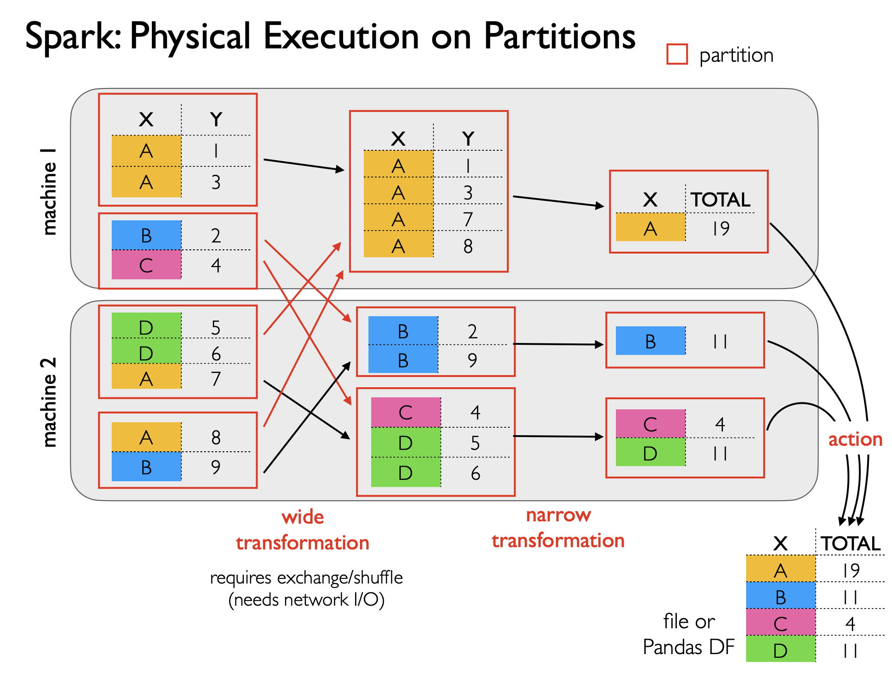

Optimizations:

- Repartition with a hash partitioner, ensuring that data with the same key is in the same partition. Dependencies between partitions are decreased, e.g. group A now only depends on 1.1 and 2.1.
- Partial aggregation: Aggregates are computed on each partition first. Multiple rows with the same key in the same partition will be combined, and only an aggregate will be sent during shuffling.
- `spark.sql.adaptive.coalescePartitions.enabled`: Number of partitions after shuffling is default to `spark.sql.shuffle.partitions` (default 200), which is often too much.
- When the data were created, use `bucketBy` to pre-partition data based on a certain column.

### Joining

Grouping of two tables on a common key and matching rows of the same group ("equi join"). If there are multiple rows in a group, do a Cartesian product.

- Left join: Returning all records in the left table. If there is no row in a group in the right table, fill with `null`.
- Inner join: If there is no row in a group in the right table, discard the group.
- Outer join: Returning all records that have values in either table. If there is no row in a group in either the left or right table, fill with `null`.

**Broadcast hash join (BHJ)**

The smaller table is loaded to a dictionary and broadcasted to all the executors that has a partition of the bigger table. The dictionary needs to fit into memory. Each executor then joins their partition of the bigger table with the dictionary.

Only the smaller table is sent over the network, but multiple times.

When does BHJ tend to do well?

- when one table is much smaller than the other
- when the smaller table fits entirely into memory as a hash table
- when the bigger table is relatively concentrated in a few workers

**Shuffle sort merge join (SMJ)**

Both tables are hash partitioned on the join key. Partitions are shuffled across network so that the same executor get corresponding partitions from either table. Each partition is then sorted. The partitions are joined in a pairwise manner, one from either table.

Each table go over network once.

```python
(calls
  .join(
    holidays.hint("merge"),
    calls["CallDate"] == holidays["date"],
    how="inner"
  ).groupby("date", "holiday")
  .count()
).explain()
```

`hint("merge")` is used to force a sort merge join. It is useful when the optimizer chooses a broadcast hash join, but the table is too big to fit in memory.

`hint("broadcast")` is used to force a broadcast hash join. Simplified output:

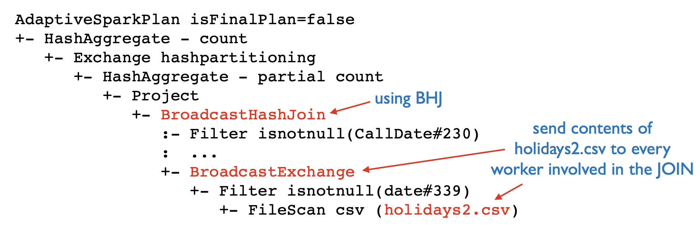

## Spark MLlib

### Existing Libraries

#### scikit-learn

```python
model = ...
model.fit(X_train, y_train)
model.predict(X_test)
```

#### pytorch

```python
model = ...
optimizer = torch.optim.Adam(model.parameters(), lr=0.01)
criterion = torch.nn.CrossEntropyLoss()
for epoch in range(100):
    optimizer.zero_grad()
    output = model(X_train)
    loss = criterion(output, y_train)
    loss.backward()
    optimizer.step()
y_test = model(X_test)
```

#### Spark MLlib

```python
unfit_model = ...
fit_model = unfit_model.fit(df_train)
df_test_result = fit_model.transform(df_test)
```

#### Comparison

- Models are immutable, and the `fit` method returns a new model. scikit-learn `model` and pytorch `model.parameters()` are mutable.
- There is usually only one features column in `df`, each row is a feature vector. In scikit-learn, the features are passed as a matrix, and in pytorch, the features are passed as a tensor.
- The `transform` method returns a new DataFrame with the prediction column appended. Both scikit-learn and pytorch return the prediction alone.
- `.transform` in scikit-learn and Spark MLlib is both used for data processing.
  - In scikit-learn, it is used to transform the input data (data preprocessing), e.g. scaling, encoding, etc. For details see the next section.
  - In Spark MLlib, transformations are applied in wider contexts and include feature engineering, normalization, etc. A fitted model is a transformer in the sense that it adds a prediction column.

### Pipelines and PipelineModels

A Pipeline in Spark is a way to streamline a sequence of data processing and modeling steps. In plain words, a pipeline is used to train a model, while a pipeline model is used to process test/validation data and make predictions.

It consists of a **sequence** of stages that data flow through, each of which can be either a Transformer or an Estimator. Defined in this way, we can also say that a PipelineModel is a specific type of pipeline, only consisting of transformers.

- Transformers are algorithms that transform one DataFrame into another, usually by appending one or more columns. Examples include feature transformers like Tokenizer or HashingTF.
- Estimators are algorithms which can be fit on a DataFrame to produce a Transformer. For example, a learning algorithm like a LogisticRegression is an Estimator, which, after being fit, becomes a Model (a type of Transformer). The model's `transform` is then called.

A PipelineModel retains all transformers, as the test/validation data need to go though the same transformations as the training data. But the estimator is replaced with the fitted model (a transformer).

`pyspark.mllib` is based on RDDs, while `pyspark.ml` is based on DataFrames.

### Decision Trees

Term review:

- Decision tree
- Random forest (similar: gradient-boosted trees)

Tree-based methods are still relevant in the age of deep learning. Actuall deep learning is often used to convert unstructured data to structured data, which is then fed into tree-based methods.

Stopping criteria:

- max depth, min samples per leaf
- min entropy of y, i.e. (almost) pure leaf, or y is determined
- all features are used up
- the most informative feature has an entropy of 0, i.e., all the features are the same in the subset of data.

What is used to pick the best split:

- Mutual information between a feature and the outcome: Used in a decision tree or classification tree. A determinant value of a feature reduces entropy (uncertainty) of the outcome (information gain). The feature that has the highest mutual information is chosen to split the data.
- The purity of the outcome in leaves (e.g. variance): Used in regression tree where the outcome is continuous. Not only the choice of the feature is determined, but also the choice of the split point. Theoretically all split points are to be experimented, by sorting on that feature first. We choose the split that results in the largest impurity reduction in child nodes, given by $|D|×Var(D)−(|D_L|×Var(D_L)+|D_R|×Var(D_R))$.

The calculation of mutual information or purity is expensive when the data of a node cannot fit into the RAM of one worker.

- Expensive shuffling: All data is needed for the calculation of the variance, sort is needed to find possible split points.
- We optimize the algorithm that we can calculate the variance in one pass: When changing the split point, we are essentially moving only a few rows. The new variance can be calculated incrementally on top of the old variance and the moved rows. But the incremental calculation is likely to only utilize one worker, as the moved rows are likely to be in the same partition. This results in no parallelism.

#### PLANET Algorithm

*PLANET: Massively Parallel Learning of Tree Ensembles with MapReduce*

##### Aggregate Tuples

This algorithm is based on the observation that the calculation of the variance can be done with a narrow dependency and therefore parallelized.

$$
\begin{aligned}
\text{variance} &= \frac{1}{n} \sum_{i=1}^n (y_i - \bar{y})^2\\
&= \frac{1}{n} \sum_{i=1}^n (y_i^2 - 2 y_i \bar{y} + \bar{y}^2)\\
&= \frac{1}{n} \sum_{i=1}^n y_i^2 - 2 \frac{1}{n} \bar{y} \sum_{i=1}^n y_i + \bar{y}^2 \\
&= \frac{1}{n} \sum_{i=1}^n y_i^2 - \bar{y}^2
\end{aligned}
$$

Therefore, the $Var(D), Var(D_L), Var(D_R)$ using the following aggregated, which can be calculated in one pass distributedly. For a record in each partition that belongs to the node to split and whose feature $x_i$ is smaller than the splitting point $s$, we calculate the following aggregates:

- The sum of $y_i^2$: Will be reduced to $\sum_{i=1}^n y_i^2$
- The sum of $y_i$: Will be reduced to $\bar{y}$
- The number of $y_i$: Will be reduced to $n$

They are stored in a table of aggregate tuples that can be calculated narrowly (requiring no shuffling).

$$
T_{n,X}[s] = \{ \sum y, \sum y^2, \sum 1\}\\
\text{where} \quad s \in \text{split points}, X \in \text{features}, n \in \text{nodes to split}
$$

- $Var (D_L)$ is given by $T_{n,X}[s]$
- $Var (D)$ is given by $Var (D_L)_{s_{max}}$, where $s_{max} = \max(X)$
- $Var (D_R)$ is given by $Var (D) - Var (D_L)$.

Consequences:

- Partial aggregation in each partition (narrow dependency): Network transfer is minimized by only sending the aggregate tuples to the reducer. The reducer then calculates the variance and chooses the best split point.
- Filter the records and see whether they belong to the node to split (by applying the splitting path), rather than relocate the records in a logical node to one physical worker: Each row, no matter which partition / worker it is in, contributes to the calculation of impurity reduction in $T_{n,X}$ of that node.

##### Histogram

PLANET trades a perfect splitting point for efficiency. Prior to tree induction, instead of sorting on every ordered attribute, PLANET instead computes an approximate equidepth histogram for every ordered attribute, i.e., find the bins that have the same number of data points. A single split point is considered from each bin.

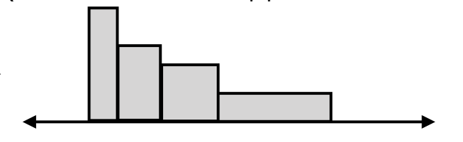

For categorical feature, each unique value is considered as a split point.

##### Other optimizations

1. Once a node can fit into memory, repartition to a single partition and split the tree node locally on their own until stopping criteria are met. This can also be done in parallel with (2).
2. Find best split for different nodes in parallel---$n$ as in $T_{n,X}$ can contain multiple nodes.

## HBase and Cassandra

HBase is the distributed database for the 1st generation of Hadoop, mirroring Google's BigTable. Cassandra is the distributed database for modern Hadoop. 

HBase is based on HDFS to interact with the workers, while Cassandra is based on Amazon's Dynamo.

### HBase

HBase Data Model: Versioned spark tables.

#### Layout: No-SQL, Wide Row Design

A table is a collection of rows. Within each row, data is organized into column families. A column family contains multiple columns, and each column can hold multiple versions of its data, identified by timestamps.

- Columns can grow, just as rows
- Each row can have different columns (columns of each row can misalign)
- Empty cells are not stored

**Wide Row** Design: No efficient way to know all columns of all row. Instead, we can easily know all columns of a row.

Implications:

- Optimized for sparse data
- SQL-like query language is not supported

#### Physical Aspect

- A row range is called a region. It may grow (and split). A region is assigned to a region server, while a region server can serve multiple regions. A row is guaranteed to be in one region.
- A region server is typically placed on the DataNode that stores its regions.
- HBase only supports single-row transactions.
  - Design implication: Try to keep all of a user's data in ONE row, even if it means millions of columns---an additional layer of column family is used to organize the columns, both logically and physically (they are stored together).
- Even if a region server dies, data are still safely stored in 3x replicated HDFS files. They can be handover to other region servers.

I/O: Not optimized for random writes and reads

- Random writes are grouped in memory and then sorted, ending with a big write.
- Reads for a single key (random reads) need to check multiple files. Not suitable for OLTP.

Optimizations:

- Compaction: Combine smaller files.
- Tombstones / ghosts are used to mark deleted cells.
  
### Cassandra

#### Physical Aspect

Cluster:

- No centralized boss node
- Not necessarily in the same data center
- Clusters are called rings, as some nodes are defined to be adjacent, and such edges form rings. Ring organization doesn't necessarily correspond to network topology

Keyspaces

- Each store data across many workers
- Different keyspaces can have different replication strategies

#### Wide Partition design

Also No-SQL, but partially supports SQL-like query language.

- A column family is a collection of rows that correspond to a table in RDBMS. It is schema-optional.
- A partition is a collection of rows that are stored together physically on disk.
  - All the rows in a partition are uniquely identified by a partition key (the partition key is part of their primary key).
  - The partition key determines how data is distributed and accessed across the Cassandra cluster.
- The wide partition design allows for efficient data access patterns where you often need to read or write multiple related rows simultaneously.
  - Use cases: Time-series data, user profiles, or any scenario where a natural clustering of data occurs.

Trade-offs:

- Large partitions can become a bottleneck, as they may lead to uneven data distribution across the cluster, increased memory usage for managing the partition index, and slower data access times.
- Small partitions can lead to inefficient data access patterns, as Cassandra needs to read from multiple partitions to retrieve related data.

Columns:

- Partition key column.
- Clustering columns: Columns that each row has its own. Rows are ordered according to cluster columns (e.g. time). Efficient range queries on those columns are well supported.
- Static columns: Shared among all rows in a partition, by being associated with the partition key. They reduce redundancy, e.g. when we have multiple rows about the same entity.
- Regular columns.

Implications:

- Expect no join operation of partitions and store all relevant data in a single partition!
- Carefully choose the partition key and clustering columns to optimize the data access patterns!
- Only expect **partition key of the whole table** and **clustering columns of a partition** are part of the shared schema, so that they can be queried upon. Other columns can also be queried upon, in the sense that rows without that column are skipped.

## Cassandra

### Partitioning

The data model and storage layout of Cassandra was inspired by BigTable, as HBase was. But its strategy of partitioning and replication is influenced by Amazon's Dynamo---Goal: High availability.

How to associate a partition (replicas) with node(s)?

- HDFS NameNode: A map data structure
- Spark: partition_key --hash-func--> hash value --data-structure--> node
- Cassandra: consistent hashing
  - (1 partition_key, 0+ cluster_key(s)) is the primary key, i.e., uniquely identifies a row.
  - partition_key, cluster_key --hash-func--> token --range--> node
  - Nodes are assigned to the whole number line (from smallest int64 to biggest), denoting the inclusive end of a range.
  - Tokens of rows span across the number line.
  - Rows in the wrapping range (larger than the last node) are assigned to the first node.---a cluster is called a token ring

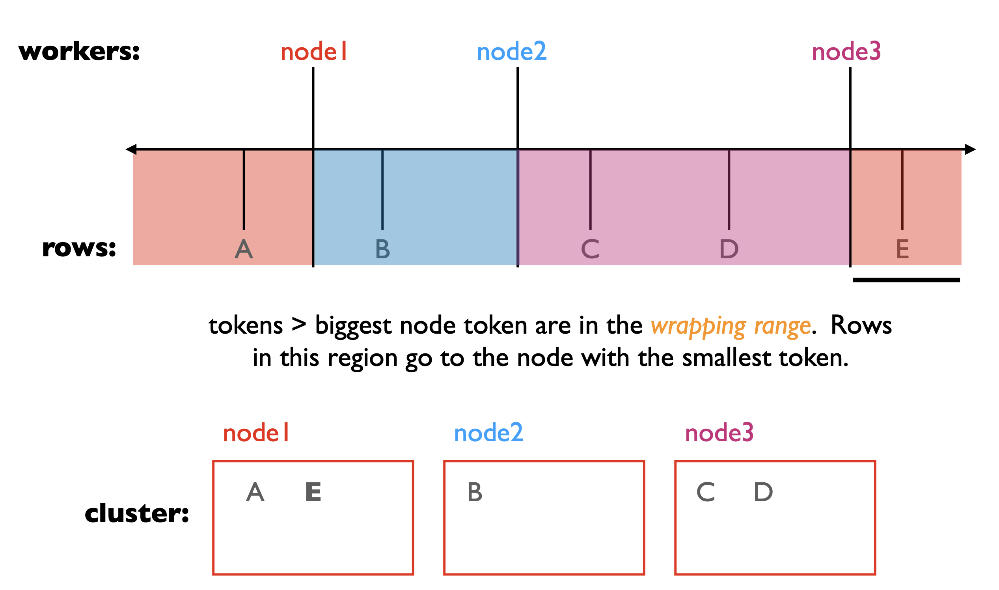

File size --> scalability. The larger the file size is,

- Efficient I/O and optimized network transfer for sequential reads and writes
- More fragmentation within a file and within a node
- Smaller metadata residing on master/NameNode (less overhead for consistency guarantee, etc)
- Hot spots are more likely

Elasticity, incremental scalability

Adding a new node---What partitions/rows need to move?

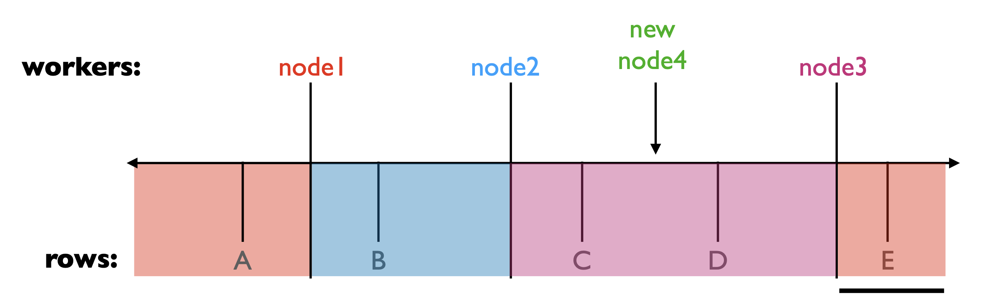

Data movement is minimized by only moving the data that are affected by the new node. If using hash partitioning, (N-1) / N of the data need to move (why??).

Problem: latest Cassandra versions by default try to choose new node tokens to split big ranges for better balance (instead of randomly picking). Adding multiple nodes simultaneously can lead to collisions, preventing nodes from joining.

Solution: add one at a time (after initial "seed" nodes)

Load balancing

- Only load of node 3 is alleviated
- Node 3 bears all the burden of transferring data to node 4

Solution: vnodes. Each node is responsible for multiple ranges

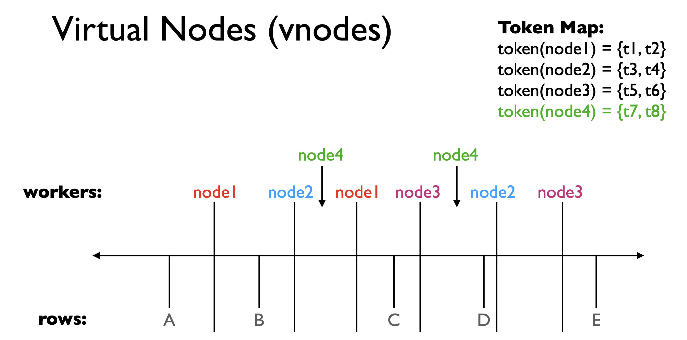

Heterogeneity: If a machine has more resources, it can represent larger ranges (more inserting points).

Token Map Storage

- Replicated on every node. A client can contact any node.
- Gossip: When adding a new node, one or a few nodes are notified. We then reply on them to spread the words---a random friend per second.

### Replication

Each keyspace can have a different RF (replication factor).

Which nodes to choose? The node designated to that range and the ones after, skipping vnodes that are the same real node, until the RF is reached.

Additional built-in option: Considers network topology or other heterogeneity of nodes.

When the client entrusts the coordinator to write. When do we send ACK to client? We can have different consistency levels, e.g. when N-1 machines send back ACK. W for Write factor.

What if the stale copy is read? We can configure the read to go to 2 replicas, i.e., one for the actual data, one for the checksum. R for Read factor.

When W + R > RF, we can guarantee that a read from stale copies will be detected.

Tuning R and W:

- To make reads highly available, set R low;
- To make writes highly available, set W low;
- When speed and availability is more important than consistency, set R + W < RF.

More than one failure could result in conflicting versions: Each replica contains the newest version of some part of data. The system keep them all and resolve the conflict later, by

- Send all versions back to client and let the client decide (Dynamo)
- Automatically resolve the conflict by timestamp (Dynamo, Cassandra)

## Kafka

### Background

RPC (Remote Procedure Call) is a way to call a function on another machine. It is synchronous and blocking.

Streaming is a way to process data in real-time. It is asynchronous and non-blocking.

ETL Problem: 

- ETL needs to detect changes in the OLTP databases and update the OLAP databases accordingly. Data freshness matters. --- Stream ETL
- Too many ETLs when data from the same set of OLTP databases are needed by multiple OLAP databases or data lakes. --- A unified log of many consumers and producers.

### Producer -- Topic -- Consumer

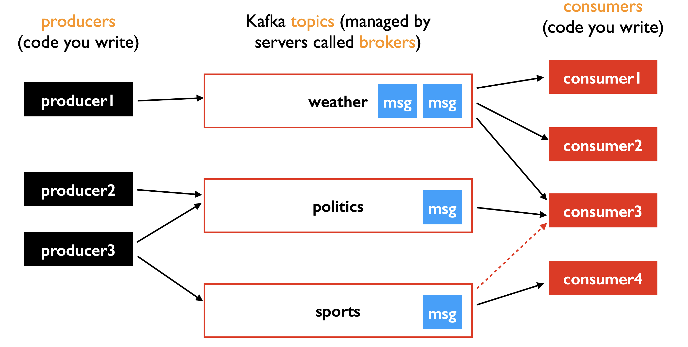

- Consumers only poll messages that they have not seen before.
- Messages are not deleted in the broker after being consumed.
- Messages are immutable and append-only.

A message is a key-value pair. The key is usually one entry in the value. It is optional,

- The broker could consist of multiple servers to handle the message load.
- A topic can be partitioned. A partition is assigned to a broker.
- How producer rotates among partitions?
  - Messages without keys: Round-robin
  - Messages with keys: Hash the key to determine the partition or plug in a custom partitioner.

```python
batch = consumer.poll(1000)
for topic_partition, messages in batch.items():
    print("Topic:", topic_partition.topic, "Partition:", topic_partition.partition)
    for msg in messages:
        print(msg.value)
```

A consumer polls data in batches.

- Each batch consists of messages from a subset of partitions and possibly multiple topics.
- The messages within each partition start at a certain offset. The offset dict is managed by the broker, per topic/partition/consumer-group. Like `read()`, the consumer can also manually seek an offset.

Changes to a topic:

- Append right
- Delete left but does not change the index

Ordering:

- Only partially ordered (no transitivity, could form a tree), like git commits.
- Only the order (of being written) within a partition (the same topic) is guaranteed. Choose your key carefully! Try to create enough partitions initially and never change it. If no keys are specified, then no guarantee about what order messages are consumed.
- An additional timestamp can be included to track event time (not the written time). The consumer can then reorder the messages. It is also used to enforce retention policy and windowed operations.

In each group, can also manually assign partitions to consumers. This information is also stored in the broker.

```python
tp0 = TopicPartition("clicks", 0)
...
consumer2.assign([tp0, tp1])
consumer3.assign([tp2, tp3])
```

Otherwise, simply do `consumer2.subscribe("clicks")` and partitions are automatically assigned to consumers when polling starts. To ensure exactly-once semantics & consistency, Kafka shouldn't re-assign partitions in the middle of a batch.

### Broker Servers

Partitions are divided into consecutive regions and saved in segment files.

All new data is sequentially written to the end of an active segment. <==> Rollover: Finalize a segment. --- Rollover policy: max segment size (7d), max segment time (1G), etc.

Old segments (non-active) can be deleted. --- Retention/deletion policy: log age cutoff (7d, applied to the newest message in a segment), log size cutoff (disabled), etc.

### Fault Tolerance

Replication factor: 1 leader replica + RF-1 follower replicas.

- Producers only send to leaders and wait for an ACK.
- Followers constantly fetch from leaders to be "in-sync" (definition tunable)
- Messages are committed when written to ALL in-sync replicas. Only if they all fails (strength tuned by min.insync.replicas), durability guarantee is broken.
- Other config: 
  - min.insync.replicas. If exceeded --- back pressure (reject some messages).

If the leader fails, elect a new in-sync one by a special controller broker (Zookeeper or KRaft). 

- Failover takes some time. P.S. Cassandra tries to be highly available, so it doesn't differentiate between leader and follower.
- New leader decides the offsets

### Consistency Guarantees

- Consumers never see a message though the producer receives an ACK. Sol. Opt in to stronger ACK, e.g. `acks=all`.
- Duplicate reads (probably because the new leader select an offset behind a read message). Sol. Never let an uncommitted message be consumed (default).

Semantics:

- `acks=1` or `acks=0` + only read committed messages: At-most-once semantics
- `acks="all", retries=10`: At-least-once semantics. A retry may send an additional message. 
  - Duplicate messages are okay if they are idempotent. We can make everything idempotent by suppressing duplicates (done either by broker when receiving messages from the producer or handled by the consumer).

Exactly once semantics:

- Producer: `acks="all", retries=N`, `enable.idempotence=True` (only in Java version, can also handle ourselves): Exactly once semantics.
- Consumer: What if a consumer dies and is replaced by a new one? Commit its offset occasionally to the broker. Tune `auto.commit.interval.ms` and `enable.auto.commit=True`. There is still a chance that a message is consumed twice. For critical consumes: 
  - `c.commit()` after processing a message.
  - Write offsets to a DB or file in the consumer locally.

## Spark Streaming

Mini-batches divided by `trigger(processingTime="12 seconds")`. Each mini-batch is a RDD. DStream requires some "state", which is also expressed by RDDs, each from a minibatch. They are stateful in the sense that each new RDD depends on previous one to be computed.

`spark.sql.shuffle.partitions` defaults to 200. It often needs to be reduced for streaming jobs. We may need to coalesce the RDDs to reduce the number of partitions.

Coalescing is not optimized for streaming jobs. Because the data distribution may change over time.

Output modes: (into sink)

- Append: Only new rows are output.
- Update: As an update query to a DB
- Complete: All rows are output, usually only for aggregates, otherwise too expensive.

Recovery:

- Only state RDDs need to be recompute. It is done by following its lineage.
- Requires the source data is replayable. Checkpoint DStream to avoid looking up ancient data that may be no longer available.
- Multiple worker can share recovery workload.

Aggregation: Many aggregations can be computed incrementally, enabling us to use the update mode instead of complete mode frequently.

Watermark: Group by time window and emit output for a certain time window based on watermarks. It is a threshold for late data. It is used to handle late data and out-of-order data.

Pivoting: Reorganize rows that involve schema change (animal_name -> {all species}) What if a new row dictate a new column? Therefore, pivoting is not supported in streaming but only batching.

Exactly once semantics.

Prerequisites:

- Code is deterministic.
- Replayable source.
- Sink is idempotent (can suppress duplicates). HDFS supports this. Spark writes checkpoint files that identify which output files correspond to which input messages. Using those files, spark can suppress duplicates when reading a parquet file from HDFS.

### Joining

Static--stream:

- animals (id, name): static. Cached if possible.
- sightings (beach, animal_id): Stream. New batch can be joined with the static data either by (broadcast) hash join or (shuffle) sort merge join.

Joins:

- Inner join: What known animal do we see? Ever growing.
- Left join: Are there any sightings of unknown animals? Ever growing.
- Right join: Are there any animals that are never seen yet? Ever shrinking. But we can't know when to remove them. This is also not supported by Spark.

Stream-stream:

- closures (date, time)
- sightings

Inner join: How many sharks are seen on days when the beach is closed?

Group in windows and emit each window based on watermark. Spark works without watermark by default, it keeps using more and more memory.

# The Cloud

## Introduction

### Resources

Forms in which to buy compute

- VMs on multi-tenant hosts (typical case): what we did this semester
- VMs on sole-tenant hosts (better isolation/security, $1000s/month)
- Containers (Kubernetes Engine)
- Serverless Functions (functions run when events happen; pay by the millisecond)

Memory

PaaS: memcached (cache), redis (in-memory DB)

Disk: Virtual block devices

Network

Cloud hierarchy: continents, regions, zones

- Fault tolerance: Assume a whole region can go down.
- egress rate can be high

Billing model

- Free tier, discounts at scale
- Two VM deployment types: on-demand, spot
- Scaling: fixed, auto scaling, pay as you go

### Programming and Applications

Cloud alternatives to big data applications:

- HDFS: Colossus on Google Cloud Storage (GCS). GCS produces a HDFS interface and supports anything that HDFS supports, e.g. Spark.
- Spark SQL: BigQuery
- Parquet: Capacitor
  - Optimization: run-length encoding, dictionary encoding for repeated values
- Cassandra: BigTable
- Kafka: Confluent Kafka

All the major systems we have learned this semester (HDFS, Spark, Cassandra,
Kafka) are distributed under the Apache license. Thus, it is possible to build
companies around closed-source variants of these systems. Examples:

- Databricks (Spark)
- Datastax (Cassandra)
- Confluent (Kafka)

### BigQuery

Complex types:

Basics
- BOOL, INT64, FLOAT64
- STRING, BYTES
- DATE, DATETIME

Nesting

- STRUCT: A record
- ARRAY: A list

CROSS JOIN

- Cartesian product
- No `ON` clause, can filter with `WHERE`

UNNEST: Flatten an array into multiple struct, can be seen as a table.

CROSS JOIN + UNNEST

```sql
SELECT x,y,z
FROM tbl
CROSS JOIN UNNEST(tbl.coord)
```

Table:

| x | coord |
|---|-------|
| 1 | [{2,3}, {4,5}] |
| 2 | [{6,7}, {8,9}] |

Result:

| x | y | z |
|---|---|---|
| 1 | 2 | 3 |
| 1 | 4 | 5 |
| 2 | 6 | 7 |
| 2 | 8 | 9 |

Only correlated rows are cross joined.

Geographical data: BigQuery supports common geo operations (e.g. join, on shapes) and uses lat/lon by default.

### ML Basics

Supports SQL-like queries.

`DATA_SPLIT_METHOD`: Unusual behavior and short retention time. Recommend to split manually in SQL and disable the automatic split.

```sql
CREATE OR REPLACE MODEL mymodel
OPTIONS(MODEL_TYPE='linear_reg',
        DATA_SPLIT_METHOD='NO_SPLIT',
        INPUT_LABEL_COLS=['label'])
AS
SELECT feature1, feature2, label
FROM dataset
```

Hierarchy: Projects, datasets, tables, models.

Using models:

- `ML.WEIGHTS(MODEL mymodel)`: Get the weights of the model.
- `ML.EVALUATE(MODEL mymodel, (SELECT feature1, feature2, label FROM dataset))`: Evaluate the model on a dataset.
- `ML.PREDICT(MODEL mymodel, (SELECT feature1, feature2 FROM dataset))`: Predict the label of a dataset.

Each returns a table.