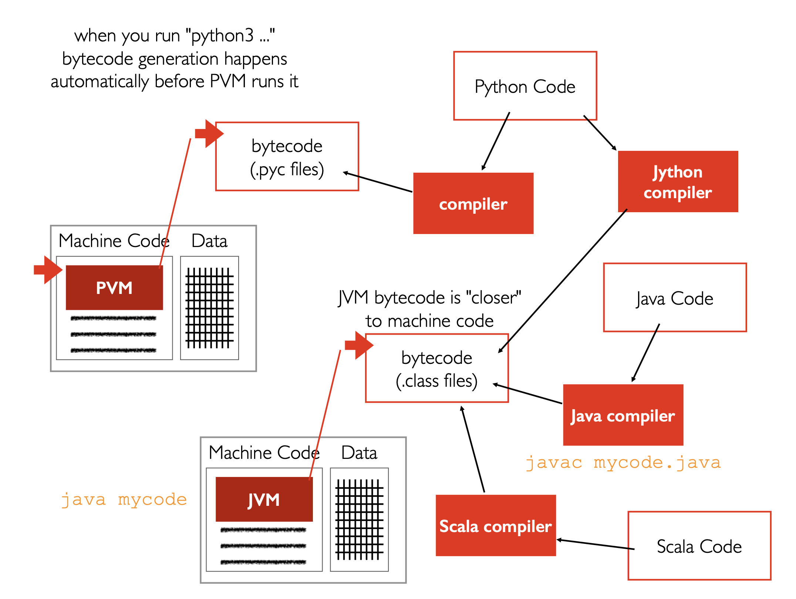
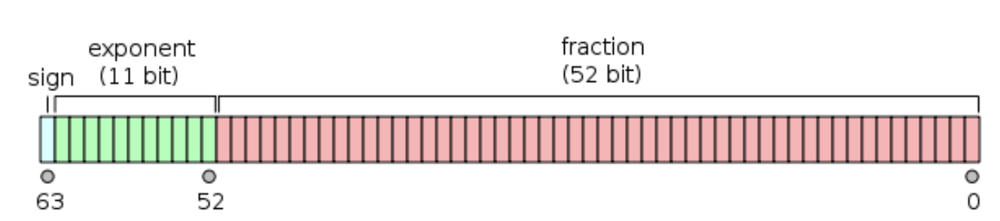
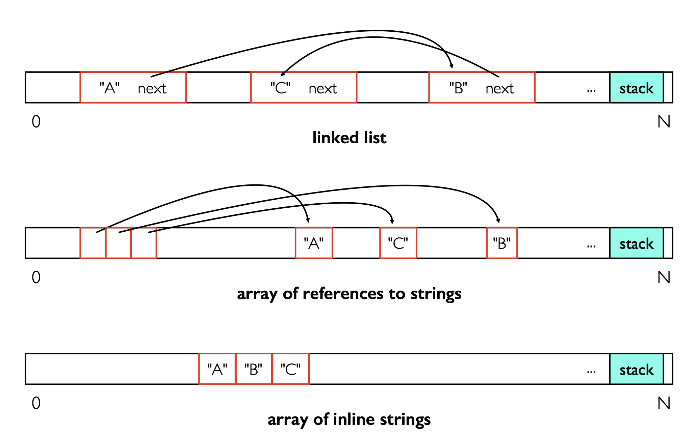
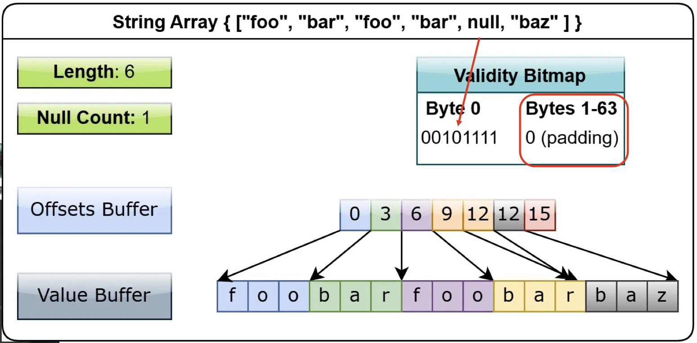
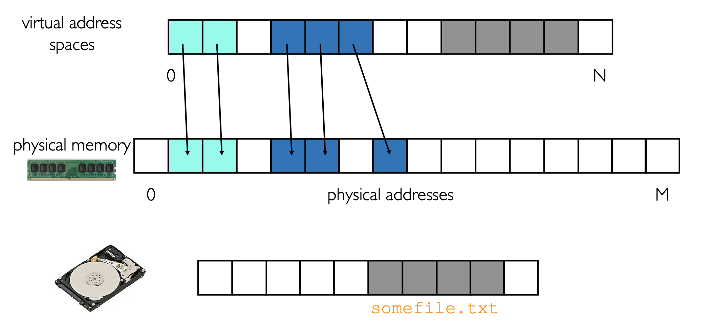
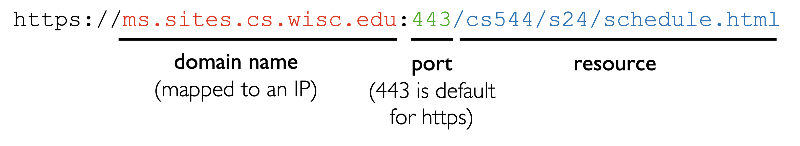
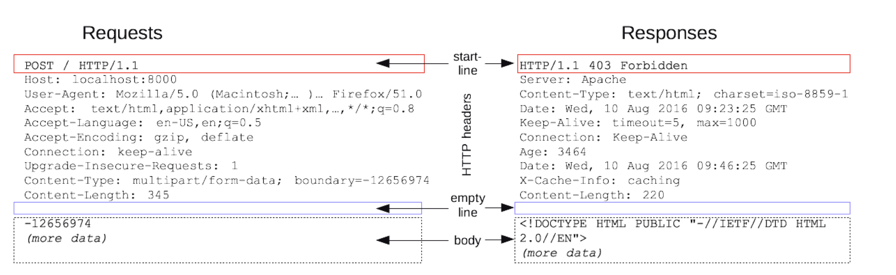
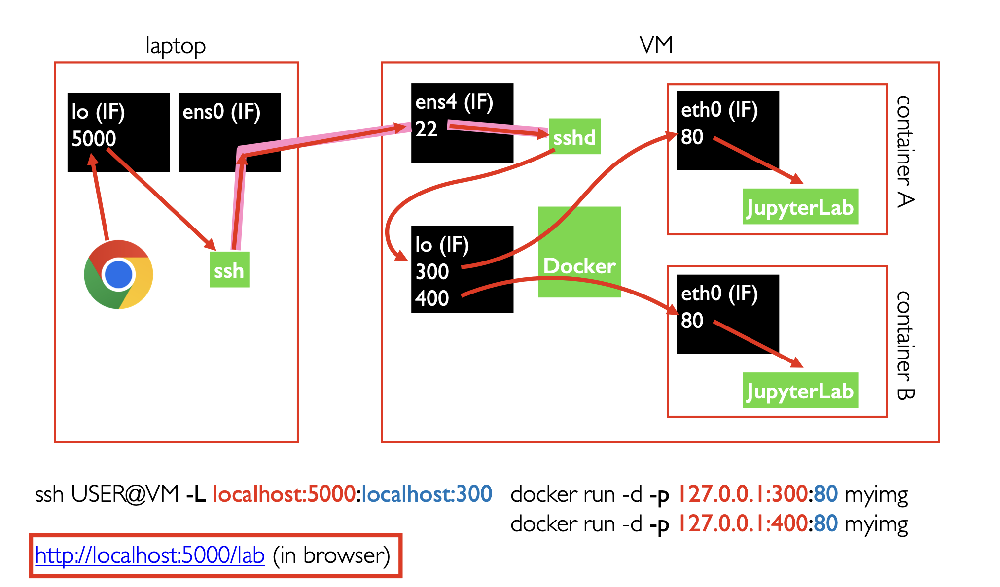
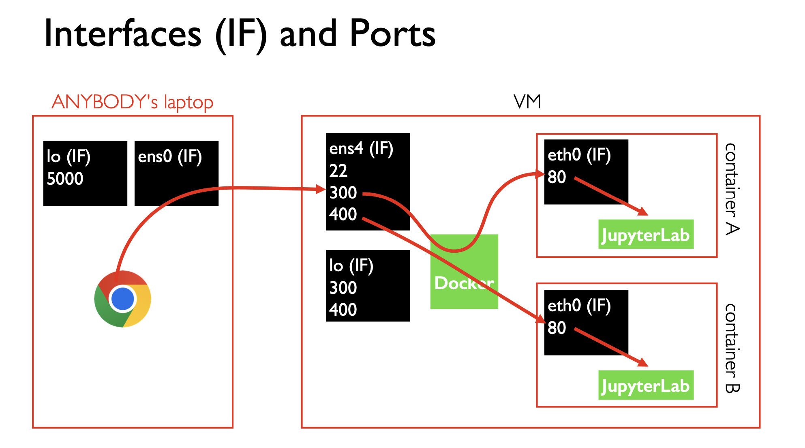

# Resources and Deployment

## Introduction to (Big Data) Systems

Big data systems: Systems are a software that manages computer resources and provides common services for other programs. Potential problems with systems appear as datasets grow. Resources need to scale out. Multiple computers make up a cluster.

Three approaches to run code:

- Compiler translates from high-level code to machine code.
- CPU runs an interpreter program that loops over programmer's code and runs it
- Compiler creates bytecode; a virtual machine running on the CPU runs the bytecode



Resource metric for **computing** power: **FLOPS** (floating-point operations per second)

- floating-point ops: add, mult, etc
- prefixes: K (thousand), M (million), G (billion), T (trillion)

Ex. NVIDIA GeForce GTX 1080 Ti provides 11300 G FLOPS. While Intel Core i7-6900K Processor Extreme Ed. provides 409 G FLOPS.

The “64-bit” of a 64-bit system refers to

- CPU's data bus width: The amount of data (in bits) that can be transferred between the CPU and the memory system in one operation && can be handled “natively”. A 64-bit system can natively handle unsigned number from 1 to 2^64-1.
- Address bus width: All 0 1 combination in a 64-bit virtual memory address is 2^64, that is, there are 2^64 addressable bytes. Therefore, the space is 2^64 byte = 8 GB.

Storage: HDD and SSD. Both are block devices, or block-addressable. A block is, for example, 4 KB.

## Prerequisites Revisit

### Unix

1. "Make each program do one thing well. To do a new job, build afresh rather than complicate old programs by adding new 'features'."
2. "Expect the output of every program to become the input to another, as yet unknown, program. Don’t clutter output with extraneous information. Avoid stringently columnar or binary input formats. Don’t insist on interactive input."

### Floating-Point Operations

Python Types:

- int: no max/min size (unusual!)
- floats: 64-bit ("double precision", 32 bits would be single precision, see pic below). 
  - `Inf`, `-Inf`, `NaN` have special bit combinations. `Inf + Inf = NaN`. 
  - `sys.float_info.dig` yields the maximum **number of decimal digits** that can be faithfully represented in a float
  - `sys.float_info.epsilon` yields the smallest number that can be added to 1.0 and **yield a different number**
- complex: not covered.



Common numeric types that CPUs can directly manipulate and PyTorch (dtype) supports:

- integers: uint8, int8, int16, int32, int64
- floats: float16, float32, float64

```python
import torch
x = torch.tensor(3.14, dtype=torch.float64)
print(x.element_size())
```

- `3.14`: python float—8 bytes
- `x`: PyTorch float 16—2 bytes

Trade-offs:

- precision (specifying small differences)
- range (difference between smallest and biggest possible numbers)
- space (how many bytes does it take?)

Hardware support:

- MULPD: Multiply packed double-precision floating-point values
- MULPS: Multiply packed single-precision floating-point values
- MULSD: Multiply scalar double-precision floating-point value
- MULSS: Multiply scalar single-precision floating-point value
- ...

**: Scalar operation only operates on the least-significant data element. Packed operation operates on all elements in parallel.

Hypothetical Scenario: all the ints in your dataset fit nicely in 3 bytes. Should you come up with a new integer byte representation?

- Pro: utilize memory more efficiently based on your use case

- Con: your CPU won't have instructions for working with this new type. Solutions:

  - Perform the multiplication in software instead of hardware (slow!)

  - Keep the data in your 3-byte format but convert to a regular 4-byte it on an as-needed basis to do calculations (slow!). 
  - Common to have one form for computation, another for storage, messages, etc.


### ML

Categories of Machine Learning:

- Reinforcement learning: agent makes series of actions to maximize reward
- Unsupervised learning: looking for general patterns
- Supervised learning: train models to predict unknowns (today)

Predictions:

- Regression: predict a continuous value
- Classification: predict a discrete value / a category

Computation usually involves some calculations (multiply, add) with various numbers (parameters). Training is finding parameters that result in good predictions for known training data.

In practice: Randomly split data into training, validation, and test sets.

- Training: Largest set.
- Validation as a proxy for the test set. Evaluated multiple times and make adjustments. Preventing overfitting the training dataset.
- Test: simulate real-world data and only used once the training and tuning is done.

```python
a = torch.tensor(3.0)
b = torch.tensor(4.0, requires_grad=True)
c = torch.tensor(5.0)
optimizer = torch.optim.SGD([b],maximize=True, lr=0.1)
for epoch in range(10):
    z = 2 * (a - b) + c
    z.backward()
    optimizer.step()
    optimizer.zero_grad()
print(b)
```

Data size:

When training machine learning models, using the entire dataset for each step of the optimizer (known as batch gradient descent) can be highly inefficient and practically infeasible due to hardware memory constraints. Instead, we often break the dataset into batches, and use these batches to train the model iteratively. 

Use `torch.utils.data.DataSet` to create batches. In-memory datasets can be created using `torch.utils.data.TensorDataset`. 

`torch.utils.data.DataLoader`provides additional features to a DataSet, like shuffling, batching, and iteration.

This approach is called **mini-batch gradient descent**, a middle ground between batch gradient descent (using the whole dataset) and stochastic gradient descent (using a single sample at a time).

- Outer loop: epoch, over the entire dataset, consisting of multiple mini-batches
- Inner loop: mini-batch

## Compute Resources

### Threads

Threads of a process have their own instruction pointers and stacks, but share the heap.

Threads can be in one of three states: Running, Blocked, Ready.

Multi-threaded applications

- Easier share of frequently modified data structures
- New kinds of bugs: race conditions, deadlock

[Multi-process applications](https://docs.python.org/3/library/multiprocessing.html)

- Easier to program (just manually launch several processes in background)
- Better at keeping multiple cores busy simultaneously (Python specific)

### Global Interpreter Lock

Global Interpreter Lock: Only one thread can be running Python code in a process at once.

Python threads are bad for using multiple cores. They're still useful for threads blocked on I/O.

Some Python libraries using other languages allow parallelism.

Why using GIL?

cpython (main Python interpreter) uses reference counting internally to know when it can free objects. Race condition may mess with `ref_count`. Solutions:

- run one thread at a time (Python's approach) 
- lots of locking (slower for single-threaded code)

### Instruction Reordering and Caching

We can not rely on

- the order of two lines of code or that
- the code is in a single line

To enforce the logic of our code.

Ex. 

```python
import threading 
y=0
ready = False
def task(x):
    global y
    y = x ** 2
    ready = True
t = threading.Thread(target=task, args=[5])
t.start()
while not ready:
    pass
print(y) # want 25 (not 0)
```

- Possible reordering of `y = x ** 2` and `ready = True`. When `ready == True`, y is still 0.
- When `ready` in core running `main` is not stale (`= True`), `y` is still stale (`= 0`). To avoid staleness, access the variable after `t.join()`.

### Concluding advice

Use provided primitives (like locks+joins) to control isolation+ordering

- These calls control interleavings AND memory barriers (topic beyond 544)
- It's easy to get lockless approaches wrong

Correctness tips (keep it simple to avoid bugs!):

- Can you use multiple **processes instead of threads**?
- Is **one big lock** good enough for protecting all your data?
- Is it OK to **hold the lock through a whole function call**?

Performance tips:

- Avoid holding a lock while blocking on I/O (network, disk, user input, etc)
- If you have multiple updates, can you hold the lock for more than one of them?
- Use performant packages like numpy---the code in C/C++/Fortran/Rust can often run without the GIL. These will often create threads for you

## Caching

### Mechanism

Cache hierarchy: 

- CPU registers: CPU clock has billions of cycles per second (GHz), i.e., latency is less than 1 ns.
- CPU cache: Ex. Intel Xeon Platinum 9282 (2019). L1: 64 KB, L2: 1 MB, L3: 77 MB.
- RAM: Frequency is around 100s to 1000s MHz. Latency is around 10 ns.
- SSD
- HDD
- Network

Multiple metrics of latency: average latency, median latency, tail latency, etc.

Throughput would depend on how many requests can be handled in parallel.

Caching data to CPU cache, compared to RAM, mainly reduces latency, while caching data to RAM, compared to disk and network, increases throughput and reduces latency.

### Policy

#### What data to cache? 

Whenever we read something, it is added to the cache, except when the programmar explicitly says not to, by using `F_NOCACHE` when interacting with a Linux FS.We're gonna talk about this more in Spark.

#### Eviction policy (Omitted)

- random
- FIFO
- LRU

#### Granularity of caching: how much data nearby to cache?

L1--L3 cache data in units called cache lines

- modern CPUs typically 64 bytes (for example, 8 int64 numbers)
- M1/M2 uses 128 bytes

Ex. Step and multiply

```cpp
int[] arr = new int[64 * 1024 * 1024];

// Loop 1
for (int i = 0; i < arr.Length; i++) arr[i] *= 3;

// Loop 2
for (int i = 0; i < arr.Length; i += 16) arr[i] *= 3;
```

The first loop multiplies every value in the array by 3, and the second loop multiplies only every 16-th. The second loop only does about **6% of the work** of the first loop, but on modern machines, the two for-loops take about the same time: **80 and 78 ms respectively**.


Only after K reaches the cache line size, the time cost would be proportionate to 1/K.

Ex. Matrices: Summing over row hits cache, while summing over column likely misses it. Sol. First creating the matrix in a transposed way and then transposing it results in column cells storing contiguously in the memory.

Ex. Ordered collections of strings



Array of inline strings is more cache friendly for sequential read, but sacrifices simple `length()` and random read. Also, it doesn't support variable-length strings or `null`.

### Introducing PyArrow

More cache efficient compared to pandas.



A hierarchy of 3 components:

- Validity bitmap (64 bytes): 1 bit per value, 1 if the value is present, 0 if it's null + padding
- Offsets buffer: Each cell stores the offset of the start of data.
- Data buffer: The actual data, packed sequentially (similar to array of inline strings), supports different types.

A table in pyarrow is a new named arrays.

Demo:

```python
import torch
import torch.nn as nn
import torch.optim as optim
import numpy as np
import pyarrow as pa
import pyarrow.parquet as pq
import pandas as pd

# Step 1: Generate Data with PyArrow
def generate_data():
    # Generate some synthetic data for linear regression: y = 3x + 2 + noise
    np.random.seed(0)
    x = np.random.rand(100, 1)
    noise = np.random.normal(0, 0.1, x.shape)
    y = 3 * x + 2 + noise

    # Convert to PyArrow Table
    table = pa.Table.from_pandas(pd.DataFrame({'x': x.flatten(), 'y': y.flatten()}))
    # Save to Parquet file
    pq.write_table(table, 'data.parquet')

# Step 2: Load Data and Convert to PyTorch Tensors
def load_data():
    # Load the Parquet file
    table = pq.read_table('data.parquet')
    # Convert to Pandas DataFrame
    df = table.to_pandas()
    # Convert to PyTorch tensors
    x_tensor = torch.tensor(df[['x']].values, dtype=torch.float32)
    y_tensor = torch.tensor(df[['y']].values, dtype=torch.float32)
    return x_tensor, y_tensor

# Step 3: Define and Train a Simple Linear Model
def train_model(x_tensor, y_tensor):
    # Define a simple linear regression model
    model = nn.Linear(1, 1)
    criterion = nn.MSELoss()
    optimizer = optim.SGD(model.parameters(), lr=0.01)

    # Train the model
    for epoch in range(1000):
        # Forward pass
        outputs = model(x_tensor)
        loss = criterion(outputs, y_tensor)
        
        # Backward and optimize
        optimizer.zero_grad()
        loss.backward()
        optimizer.step()

        if (epoch+1) % 100 == 0:
            print(f'Epoch [{epoch+1}/1000], Loss: {loss.item():.4f}')

    # Print learned parameters
    print(f'Learned parameters: {list(model.parameters())}')

def main():
    generate_data()
    x_tensor, y_tensor = load_data()
    train_model(x_tensor, y_tensor)

if __name__ == '__main__':
    main()
```

### OS Page Cache

`mmap` call to add a new page to virtual address space, either 

- anonymous: blue in the picture

```python
import mmap
mm = mmap.mmap(-1, 4096*3)
```

Python (and other language runtimes) will mmap some anonymous memory when they need more heap space, which will be used for Python objects (ints, lists, dicts, DataFrames, etc.)

- backed by a file: grey in the picture

```python
import mmap
f = open("somefile.txt", mode="rb")
mm = mmap.mmap(f.fileno(), 0, # 0 means all
        access=mmap.ACCESS_READ)
```

Only when `mm` is actually read will the data pages be loaded into memory. It will become part of the page cache data.



We can evict the page cache, since there is another copy on disk. We can do the same for anonymous data, if we put them in a swap file on disk.

## Networking

### Basics

#### A Network

Network Interface Controllers (NICs) can connect a computer to different physical mediums, such as:

- Ethernet (wired)
- Wi-Fi (wireless)

Every NIC in the world has a unique MAC (media access control) address, usually manufacturer + device ID. There are 28 trillion possible addrs (48 bits in total). Some devices randomly change their MAC addr for privacy.

A network uses some physical tech (Wi-Fi, Ethernet, etc). Inside a network are nodes that send bytes to other nodes by MAC address. Nodes could be computer, switch, etc. Their connections are either direct, or forwarded by switches.

A computer can have multiple NICs on different networks. A router connects different networks, necessitating it to have multiple NICs.

Networks connected by routers is an internet. The internet is a network of networks. The global internet we use is the "Internet".

Packets (some bytes with an address and other info) can be forwarded along a path from point A to point B. Routers contain forwarding tables that help them decide which direction to send along a packet. Forwarding tables would be too big if a router had to know where every MAC address existed in the Internet. Instead, routers use the IP address of the destination to decide where to send the packet.

#### IP addresses

- 32-bit long: about 4 billion possible IPv4 addresses. example IPv4 address: 34.29.237.29, each field from 0 to 255.
- IPv6 (less used) space 4x larger.
- Prefix defines the network, suffix defines the machine. Mostly the router only needs to know the prefix.

Challenges

- we don't have enough IPv4 addresses
- we don't want every machine to be able to receive packets from anywhere

Private ranges allow duplicates and unreachable machines:

- 192.168.0.0 to 192.168.255.255
- 172.16.0.0 to 172.31.255.255
- 10.0.0.0 to 10.255.255.255

Network Address Translation (NAT) box: A router that translates a private IP address to a public one. This allows multiple machines to share a single public IP address. Firewall rules can be configured for such translations.

#### Transport Protocols

Network stack:

- Application: HTTP, FTP, etc. Including resource address, allowing us to visit **a specific resource** (e.g. /home).
- Transport: TCP, UDP. Including port numbers, allowing us to communicate with **a specific process** on the host machine.
- Network: IP. Including IP address.
- Link: Ethernet, Wi-Fi, etc

Most common transport protocols:

- UDP (User Datagram Protocol)
- TCP (Transmission Control Protocol)

TCP provides more reliable communication:

- retry when a packet is dropped
- buffer packets on receiving side and re-arrange so they arrive in the same order they were sent

UDP is faster and simpler, allowing applications to handle reliability and ordering themselves.

#### HTTP

HTTP (Hypertext Transfer Protocol) is a protocol for transferring web pages and other data on the internet. It is built on top of TCP. 

It relies on URL, which is a string that identifies a resource on the internet. The domain part can be translated to an IP address and port.



HTTP message parts: Method, resource, status code, headers, body. Typical headers are of 700--800 bytes.



Type of requests: POST, GET, PUT, DELETE, etc.

HTTP status codes: 200 OK, 404 Not Found, 500 Internal Server Error, etc.

### gRPC

Built on HTTP.

We can only send bytes in a request/response body. We need to **serialize and deserialize** the arguments of a RPC call. 

Also, gRPC uses Protocol Buffers to provide benefits:

- For **cross-language** calls, gRPC uses Google's Protocol Buffers provide a uniform type system across languages.
- Different CPUs **order** bytes differently (endianness). Protocol Buffers abstracts that order away and uses a fixed byte order (Little-Endian) for encoding which is known to be more efficient on a wide range of CPUs. When the data is deserialized (converted back to types), the receiving end will convert the byte order as necessary for its CPU.
- Protocol Buffers use a **variable-length encoding** for integers to save space. Small numbers take a small number of bytes, while larger numbers take more bytes.
  - The base-128 variant encoding is commonly used, where each byte has 7 bits of the number and the 8th bit is a flag to tell if more bytes are part of the integer. This way, an int32 can take 1 to 5 bytes of space depending on the value of the number.

### Docker Port Forwarding



`docker run -p 127.0.0.1:300:80 myimg`---which IP to use?

- `127.0.0.1` or `localhost`: only the host can access the container via the virtual NIC `lo`.
- `0.0.0.0` or omitted: All NICs on the local machine can access the container, so that it is accessible from other machines on the network.
- `80` denotes the port inside the container, which uses, for example, NIC `eth0`. Never use `lo` inside the container.

After changing to `docker run -p 0.0.0.0:300:80 myimg` and visiting the container in browser without SSH tunneling---



Anyone's computer can access the container, using the host's IP address. Be aware of the security risk, options:

- Use a firewall to block access to the port from the outside world
- Password in JupyterLab

Container Orchestration: Orchestration lets you deploy many cooperating containers across a cluster of Docker workers. Kubernetes is the most well known. Docker compose is a simpler tool that lets you deploy cooperating containers to a single worker.